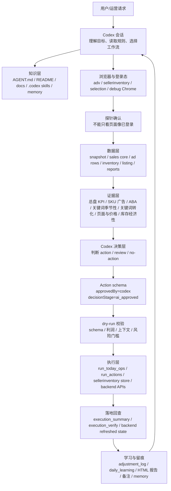
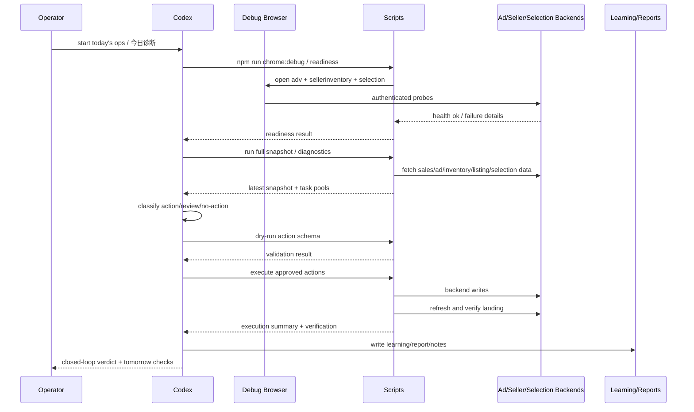

# Codex Operating Architecture

这份笔记说明当前 `D:\ad-ops-workbench` 里 Codex 的真实工作架构。

一句话：Codex 是决策和编排层，不是藏在浏览器扩展或脚本里的模型。代码负责稳定抓数、校验、执行、回查和留痕；Codex 负责读上下文、做业务判断、写可执行 schema、决定何时执行、并用结果修正下一轮判断。

## 相关入口

- 仓库总览：[[README]]
- 代理规则：[[AGENT]]
- 决策边界：[[AI_DECISION_BOUNDARY]]
- Codex/Claude 双入口：[[AI_DECISION_ENTRY_POINTS]]
- 交接 runbook：[[CODEX_HANDOFF_RUNBOOK]]
- 最小闭环：[[CODEX_MINIMAL_CLOSED_LOOP]]
- 市场证据栈：[[PRODUCT_MARKET_EVIDENCE_STACK]]
- 季节标题规则：[[SEASONAL_LISTING_COPY_RULES]]
- 关键词转化率证据：[[SELECTION_KEYWORD_CONVERSION_RATE]]
- ABA 搜索词证据：[[SELECTION_ABA_SEARCH_TERMS]]
- 关键词季节性证据：[[SELECTION_KEYWORD_SEASONALITY]]

## 总体分层

## 我负责什么

Codex 负责这些判断型工作：

- 把用户请求归类到正确工作流：每日运营、单 SKU 诊断、开发诉求、listing 文案、KPI 复盘、代码修复等。
- 读取当前规则和最近事实，尤其是 `businessDate`、`dataDate`、最新快照、最后一次执行验证、当天 learning。
- 把候选池压缩成明确结论：`action`、`review`、`no-action`，而不是留一大片模糊观察。
- 为可执行动作写 action schema，并带上 `approvedBy: codex`、`decisionStage: ai_approved`、`requiresAiDecision: false`。
- 在低风险可逆范围内推进执行，执行后检查是否真的落地。
- 对结果负责：如果业务面变差，要说清楚，不用“动作很多”掩盖经营结果。

Codex 不负责也不应该负责这些事：

- 在扩展面板里内置模型。
- 让脚本自己做最终 AI 决策。
- 绕过 dry-run、schema、执行回查。
- 保存或复用 cookie、JWT、CSRF、XSRF、selection token。
- 只看页面显示“已登录”就认为后台可用。

## 代码负责什么

代码层负责可重复、可验证、可审计的事情：

- `extension/`：浏览器扩展和后台页面桥接，负责取数、面板交互、页面上下文访问。
- `scripts/run_today_ops.js`：每日运行编排入口，生成快照、诊断、计划、执行、报告和学习记录。
- `scripts/execute/`：登录态检查、单 SKU 快诊、广告后台接口、sellerinventory 提交、selection 数据抓取。
- `scripts/generators/`：生成候选 schema。候选只能进 review，不能伪装成 Codex 决策。
- `src/ai_decision.js`：构建上下文、验证/加载 action schema、执行批准门槛。
- `src/daily_learning.js`：沉淀每日结果、归因、未闭环项和次日跟进。
- `src/low_efficiency_decision.js`、`src/proactive_audit.js` 等：提供规则判断和候选池，不替代最终 AI 判断。

## 每日运营闭环

默认顺序是：

1. 登录态和数据健康检查。
2. 低效率清理。
3. 超预算检查。
4. 季节/节气/listing 标题检查。
5. SKU/产品更广泛异常诊断。
6. 写 action schema。
7. dry-run。
8. 执行。
9. 落地验证。
10. 写日报、备注、learning、后续检查点。

每日闭环不是“跑出报告就完”。闭环成立要同时满足：

- 数据链路完整：快照、任务池、季节审计、个人趋势、报告、learning 都存在。
- 执行链路完整：schema 通过 dry-run，API 调用成功，后端刷新后确认落地，备注/日志/learning 写入。
- 最终 verdict 使用同一次目标 run 的 `manifest`、`execution_summary`、`execution_verify`、`daily_learning`，不能用历史 adjustment 聚合冒充最终结果。
- `manifest.status=success` 只代表脚本跑完；真正判断看 `dataQuality`、`actionQuality`、`runQuality`、`operatingClosure`。

## 证据系统

Codex 做判断时按证据强弱分层：

| 证据 | 用途 | 边界 |
| --- | --- | --- |
| 总盘销售/KPI | 判断业务结果和目标压力 | 优先看总账号/汇总行，卖家拆分只做归因 |
| 广告后台 SKU 行 | 判断广告动作是否有依据 | 改 bid/budget 前要看 live/backend 或最新快照 |
| 库存与利润 | 判断是否值得继续买量 | ACOS 不是唯一标准，要看清仓和库存经济性 |
| listing/价格/评价 | 判断产品承接能力 | 页面弱时优先 page-hold，不自动加花费 |
| selection 关键词转化 | 市场经济性和词机会 | 只读证据，不能单独触发 spend |
| selection ABA 搜索词 | 需求、集中度、供需压力 | 高 ABA rank 不能单独创建关键词或提预算 |
| selection 关键词季节性 | 季节窗口、旺淡季、清货和补货风险 | 只读证据，不能单独触发广告、价格、listing 或库存动作 |
| 历史 action/learning | 防重复、防震荡、看效果 | cooldown 是防抖，不是持续浪费的保护伞 |

## 决策边界

可自动执行的典型范围：

- 已支持的 SP 广告 bid 微调、暂停、预算等动作。
- 低效率清理中证据明确、风险可控的广告动作。
- 规则允许的季节性 listing 标题申请，且 live origin data 与计划一致。
- 用户已明确授权的可逆 sellerinventory 文案提交。

必须 review 或暂停的典型范围：

- 证据不足但可能高影响的 spend 扩张。
- 页面、价格、库存、利润承接明显不稳。
- top-50 或高销量 listing 文案改动。
- 非季节文案、年度主题未核验、敏感节点证据不足。
- 后端 API 显示成功但刷新后未落地。
- 需要人工账号权限、WeCom/MFA、或未登录系统。

## 三类常用工作流

### 1. 每日运营

目标是把当天可处理池压缩成可执行动作、明确 review 和明确 no-action。

默认不是按 seller 拆开解释，而是先看总业务面：销售、利润、ACOS、退货、KPI 进度、波动和数据日期。卖家或合作编号只用于定位原因。

### 2. 开发/产品诉求

用户转发 WeCom/开发消息时，转发文本就是事实源。Codex 先做产品层判断，再看广告动作。

输出要包含：

- 产品判断。
- 已执行或准备执行的低风险动作。
- 下一个检查点。
- 可直接发给开发/运营的简短中文回复。

大批量开发诉求不应该转成巨大人工审查队列。默认自判，只把极少数高影响且证据不足的项目升级给人。

### 3. Sellerinventory 文案提交

listing 文案的真实边界是“后台申请已提交待审核”，不是 Amazon 前台已生效。

标准路径：

1. 用 `GET /kernel/productEditApply/getOriginData?sku=<SKU>&type=en` 取 live baseline。
2. 生成字段级改动，例如 title 或 search terms。
3. dry-run 校验长度、字段、风险、原始标题是否一致。
4. 用户授权或规则允许后，用 browser-side form body 提交。
5. 以后台返回的 application id 和 `submitted_pending_review` 作为完成线。

## 文件和产物地图

| 位置 | 说明 |
| --- | --- |
| `AGENT.md` | 当前 Codex 在仓库内必须遵守的操作规则 |
| `README.md` | 人类可读的系统总览和日常命令 |
| `docs/AI_DECISION_BOUNDARY.md` | AI/脚本/扩展三层边界 |
| `docs/CODEX_HANDOFF_RUNBOOK.md` | 新 Codex 账号接手的运行顺序 |
| `docs/CODEX_MINIMAL_CLOSED_LOOP.md` | 闭环定义和完成标准 |
| `.codex/skills/daily-data-deposit/` | 每日数据沉淀 skill |
| `.codex/skills/developer-product-inquiry/` | 开发/产品诉求 skill |
| `data/snapshots/` | 快照、执行摘要、落地验证 |
| `data/tasks/` | 任务池、审计结果、候选计划 |
| `data/learning/` | 每日复盘、最终落地状态、后续学习 |
| `archive/` | 历史报告和原始归档 |
| `黄成喆个人数据趋势/` | 个人趋势 HTML 决策档案 |

## 安全红线

- 不让用户粘贴 token、cookie、CSRF、JWT、Inventory-Token。
- 不把 selection evidence 当成可执行广告指令。
- 不把 generator candidate 当成 Codex 已批准动作。
- 不用旧快照回答“今天”或“最新”。
- 不把 `API success` 当成落地成功，必须刷新验证。
- 不因动作数量多就报喜，经营结果恶化要明确承认并纠偏。

## 判断我是否真的完成

一个任务算完成，至少要满足其中对应的完成线：

- 数据类：最新数据源、日期、覆盖率和缺口说清楚。
- 分析类：给出结论、证据、概率/不确定性、下一步条件。
- 执行类：dry-run、执行、后端验证、备注/日志/learning 全部闭环。
- 文案提交类：后台申请成功排队，并说明改了哪些字段。
- 代码类：修改范围清楚，相关测试/语法校验跑过，未跑的验证明确说明。

如果其中任何一段缺失，只能说“部分完成”或“阻塞于某环节”，不能报 closed loop complete。
