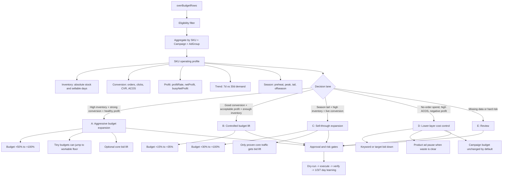

# Over-Budget Budget Elasticity Design

Date: 2026-05-09

## Purpose

Over-budget rows are a budget pressure signal, not a command to clear the advertising system's over-budget board. The operating goal is to decide whether the capped budget is protecting profit, blocking profitable growth, or wasting spend.

This design changes over-budget handling from "small budget lift by default" to "budget elasticity by inventory, conversion, and profit." When a SKU has enough inventory, strong conversion, and healthy profit, the system should allow aggressive budget expansion, including 50%-100% increases or a practical jump from a tiny budget to a workable floor.

## Core Principle

Do not treat over-budget as a cost-control signal by default.

- Efficient, profitable, inventory-backed over-budget means the campaign may be underfunded.
- Seasonal high-inventory over-budget with live demand means the SKU may need sell-through budget.
- Inefficient over-budget means the weak lower-layer traffic should be controlled.
- Campaign budget down is not the default way to handle bad over-budget rows.

## Decision Flow

## Lanes

### A. Aggressive Budget Expansion

Use this lane when the SKU can absorb more traffic.

Required signals:

- Inventory is enough: sellable days are healthy or absolute stock is high.
- Conversion is strong: recent orders exist and 7-day performance is not collapsing versus 30-day baseline.
- Profit is healthy: reference profit is positive and ACOS is comfortably inside profit room.
- No blocking readiness issue: no page hold, no tight inventory, no parent campaign or ad group state problem.

Budget behavior:

- Current budget 1-5: raise to a workable floor, normally 3-8 depending on order density and inventory.
- Current budget 5-10: allow 50%-100% lift when conversion and inventory are strong; doubling is acceptable when orders, stock, and profit room all agree.
- Current budget above 10: allow 30%-80% lift, with higher lifts only when order density, profit room, and inventory all agree.

Risk handling:

- Large budget changes are allowed only when the action carries an explicit aggressive-expansion risk level and a complete evidence block.
- Add 1-day and 3-day review expectations because the blast radius is larger than a normal small lift.

### B. Controlled Budget Lift

Use this lane when the campaign is capped and converting, but the evidence does not justify aggressive scaling.

Typical signals:

- Orders exist.
- ACOS is acceptable.
- Profit is positive or at least operationally acceptable.
- Inventory is not tight.

Budget behavior:

- Increase by 15%-35%.
- Keep this as the default lift when the SKU is good but not obviously underfunded.

### C. Sell-Through Expansion

Use this lane for seasonal or stale-inventory situations where the SKU has live demand and high inventory responsibility.

Typical signals:

- Seasonal tail, peak, or urgent demand window.
- High absolute stock or high sellable days.
- Orders still exist.
- ACOS is reasonable for the sell-through objective.

Budget behavior:

- Increase by 30%-100%, based on remaining season window, stock, order density, and profit tradeoff.
- If raising bids, only raise proven core traffic such as close match or historically converting terms.

### D. Lower-Layer Cost Control

Use this lane when over-budget spend is inefficient.

Typical signals:

- Spend and clicks with no orders.
- ACOS far above profit room.
- Negative reference profit.
- Minimum budget is still under pressure, but the traffic object itself is weak.

Action behavior:

- Do not lower campaign budget by default.
- Lower keyword, auto target, or manual target bids.
- Pause product ads only when zero-order waste is clear and there is no stronger reason to preserve that product ad.

### E. Review

Use review when the system lacks a safe basis for execution.

Review triggers:

- Missing SKU profit, inventory, or 7/30-day performance.
- Parent campaign or ad group is paused.
- Page or season readiness blocks scale.
- Proposed change is large but the evidence block is incomplete.
- Candidate schema has not been explicitly approved by Codex or manual review.

## Execution Gates

Rule-generator output is evidence only. It must not execute until rewritten or approved with:

- `decisionStage: "ai_approved"` or `decisionStage: "manual_approved"`
- `approvedBy: "codex"` or `approvedBy: "manual"`
- `actionSource` includes `codex` or `manual`
- `requiresAiDecision: false`

Budget-up actions need current budget, suggested budget, campaign id, reason, evidence, learning hypothesis, expected effect, and review windows.

Large budget increases need one of the approved budget-expansion risk levels and explicit evidence that inventory, conversion, profit, and readiness all support the move.

## Suggested Risk Levels

- `over_budget_aggressive_budget_expansion`
- `over_budget_controlled_budget_up`
- `seasonal_overbudget_sell_through_budget_up`
- `overbudget_lower_layer_cost_control`
- `overbudget_review_required`

## Learning Expectations

Every over-budget action should write a learning block.

Aggressive budget expansion should measure:

- Whether impressions and clicks increased.
- Whether orders increased enough to justify spend.
- Whether ACOS stayed inside the planned operating room.
- Whether inventory risk improved or became tight.

Cost-control actions should measure:

- Whether spend dropped on weak traffic.
- Whether same-SKU orders were preserved through other ad paths.
- Whether ACOS improved without killing converting demand.

Review windows:

- Aggressive expansion: 1, 3, and 7 days.
- Controlled lift: 3 and 7 days.
- Lower-layer cost control: 3 and 7 days.

## Non-Goals

- Do not build a second strategy layer inside the browser extension.
- Do not make campaign budget down the default over-budget cleanup action.
- Do not mechanically increase budget just because a row is over-budget.
- Do not execute generator candidates without Codex or manual approval.
