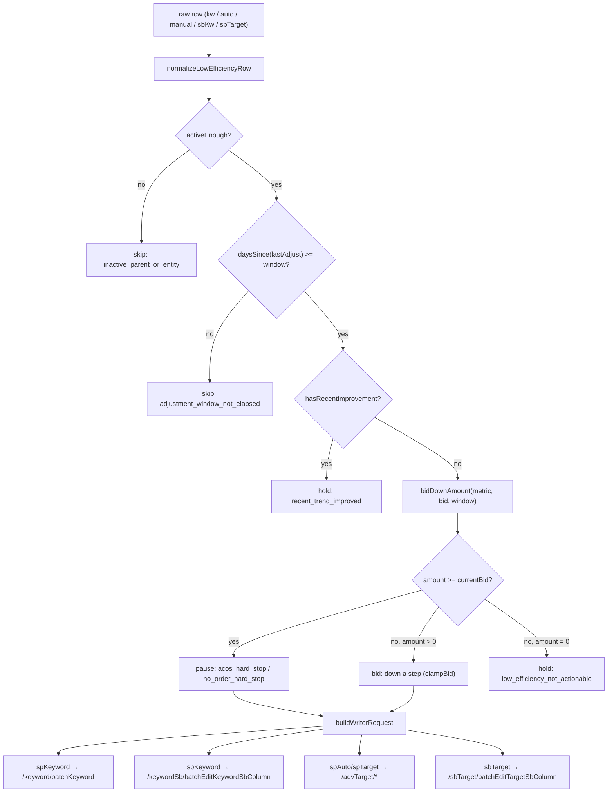

# Low-Efficiency Keyword/Target Decision Design

Date: 2026-05-15

## Purpose

Low-efficiency advertising entities (SP/SB keywords and SP/SB targets) accumulate spend without orders or with high ACOS. They need to be reviewed at fixed observation windows (default 30 days), then either held, bid-down a step, or paused — never bypassed and never blanket-paused.

This design upgrades low-efficiency handling from "ad hoc bid cuts" to a single shared decision lib, so SP keyword / SP auto / SP manual target / SB keyword / SB target all flow through the same gates and produce schema-compatible actions for the daily closed loop.

## Core Principle

The 30-day window is the default unit of judgment, not the activity-day or the 7-day window.

- A row whose last adjustment is younger than the window is **always** skipped — we have not given the previous change time to land. This avoids the "panic bid-down → re-cut next day" thrash pattern.
- A row whose long window is bad but whose 15/7/3-day windows are improving is **held** — recent improvement overrides historical waste. Do not kill a row that is currently turning.
- A row that is bad and not improving is bid-down by a step proportional to the waste, escalating to pause only when waste is extreme (≥30d, ≥15 clicks, ≥$5 spend, 0 orders) or ACOS is hard-stop level (>70% on 30d, >100% inside 30d).

The output is one shared entity shape regardless of channel, so downstream code (writer, learning, audit) does not branch on `spKeyword` vs `sbTarget`.

## Decision Flow



## Shared Entity Shape

`normalizeLowEfficiencyRow(kind, row, options)` returns:

```
{
  kind, channel, entityType, id, text, matchType,
  campaignId, adGroupId, accountId, siteId,
  campaignName, groupName,
  state, campaignState, groupState,
  bid, bidThreshold, adFormat, costType,
  updatedAt, operatedAt, hasRedMarker,
  metrics: { current, 30, 15, 7, 3 }
}
```

- `metrics.current` is always populated from the row.
- `metrics[30]` is `current` if not supplied. Caller can pass shorter windows via `options.metrics`.
- `matchType` is required for SP/SB keyword writes; the lib reads it from the row, callers do not need to splice it in later.

## Decision Bands (`bidDownAmount`)

`metric.orders === 0` (no-order):

- 30d, clicks ≥ 15, spend ≥ $5 → return `bid` (full cut → pause)
- spend ≥ $5 and bid ≥ $1 → cut by $0.20
- clicks ≥ 15 and spend ≥ $5 → cut by $0.20
- clicks ≥ 10 → cut by $0.15
- clicks ≥ 8 → cut by $0.10
- clicks ≥ 5 → cut by $0.05
- otherwise 0 (hold, not actionable)

`metric.orders > 0` (has orders, ACOS-driven):

- 30d ACOS > 0.7 → return `bid` (pause)
- <30d ACOS > 1.0 → return `bid` (pause)
- ACOS > 0.6 → cut $0.20
- ACOS > 0.5 → cut $0.15
- ACOS > 0.4 → cut $0.10
- ACOS > 0.3 → cut $0.05
- otherwise 0

`clampBid` enforces a $0.02 floor and snaps bids ≥ $0.50 to the nearest $0.05 step.

## Recent-Improvement Hold

`hasRecentImprovement(entity, window)` returns true only when **all** of:

- window ≥ 15
- long-window has orders > 0 and ACOS > 0.30
- at least one of the 15/7/3-day windows (shorter than the long window) has orders > 0 and ACOS in (0, 0.25]

Reason: a row whose 30-day data still looks bad but whose recent ACOS is already healthy is **already turning**. Cutting bid here would punish a recovery the operator already triggered.

## Writer Payload Conventions

Per channel (kept consistent with `auto_adjust.js` so the writer can reuse the existing endpoints without forking):

| kind         | endpoint                                  | property   | pause state         |
| ------------ | ----------------------------------------- | ---------- | ------------------- |
| spKeyword    | `/keyword/batchKeyword`                   | `keyword`  | `PAUSED` (upper)    |
| sbKeyword    | `/keywordSb/batchEditKeywordSbColumn`     | (none)     | `paused` (lower)    |
| spAuto       | `/advTarget/batchUpdateManualTarget`      | `autoTarget` | `PAUSED` (upper)  |
| spTarget     | `/advTarget/batchUpdateManualTarget`      | `manualTarget` | `PAUSED` (upper) |
| sbTarget     | `/sbTarget/batchEditTargetSbColumn`       | (none)     | `paused` (lower)    |

`buildWriterRequest` returns `{ method, url, body }`. Bodies always include `idArray`, `targetArray`, `targetNewArray`, `campaignIdArray` and the `column/operation` pair. Auth headers are never read or stored — the active `auto_adjust` HTTP client supplies them.

## Integration Points

1. **Lib** — `src/low_efficiency_decision.js` exports `normalizeLowEfficiencyRow`, `decideLowEfficiencyAction`, `buildWriterRequest`. Pure functions, no I/O.
2. **Tests** — `tests/low_efficiency_decision.test.js` covers entity normalization, cooldown skip, no-order bid-down, SP-auto cooldown, recent-improvement hold, and writer payloads for all five kinds.
3. **Decision pipeline** — `src/ai_decision.js` reuses the lib's `decideLowEfficiencyAction` to back-stop generated `bid` actions on keyword/auto/manual/sbKeyword/sbTarget rows. The 30-day window guard (`adjustment_window_not_elapsed`) is the source of truth and overrides any candidate that fails it.
4. **Daily closed loop** — `scripts/run_today_ops.js` and the manifest read schemas already include keyword/target bid actions; this lib is the gate that decides which become `actionType=bid`, `pause`, or `hold`.

## Out of Scope

- Negative-keyword harvesting (search-term level).
- Budget actions on the parent campaign (handled by over-budget pipeline).
- Bid-up actions on under-served keywords (handled by separate generator).
- SP product ads (entity-level pause for productAd is a different gate, not in this lib).

## Why This Spec Exists

Per the `feedback_rules_must_land_in_code` memory: doc-only rules do not enforce themselves. The 30-day cooldown, the recent-improvement hold, and the bid-down bands are all in `src/low_efficiency_decision.js` and the test file proves they hold. This document records *why* the bands look the way they do and which endpoints the writer targets, so a future change does not silently regress the closed loop.
